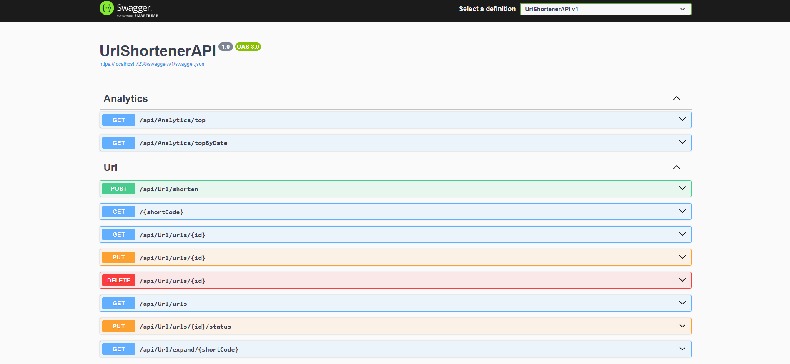
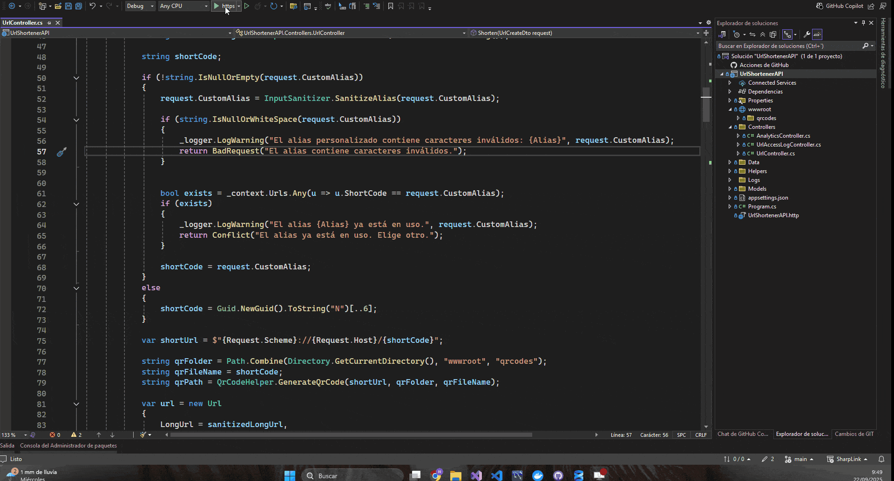
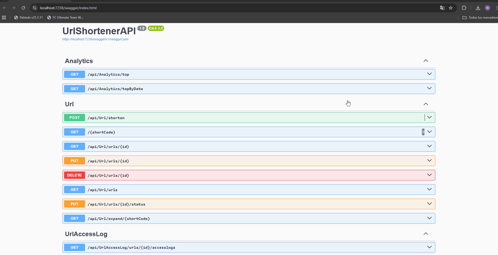

# 🔗 SharpLink

SharpLink es un **acortador de URLs** escrito en **C#** con **SQL Server** como base de datos.  
Permite generar enlaces cortos, redirigir a los destinos originales y registrar estadísticas de uso.



---

## 🚀 Características

- ✨ Acorta URLs largas en enlaces cortos y fáciles de compartir.
- 📊 Registra clics para análisis básicos.
- 🛡️ Validación de entradas y redirección segura.
- 🗄️ Base de datos en SQL Server (script incluido en `init.sql`).
- ⚡ API lista para integrarse en tus proyectos.

---

## 📂 Estructura del proyecto

```
SharpLink/
├── UrlShortenerAPI/      # Código fuente de la API
├── init.sql              # Script de inicialización de la base de datos
├── UrlShortenerAPI.sln   # Solución de Visual Studio
└── README.md             # Este archivo
```

---

## 🛠️ Requisitos

- [.NET 6+](https://dotnet.microsoft.com/en-us/download)
- [SQL Server](https://www.microsoft.com/en-us/sql-server/sql-server-downloads)
- Visual Studio / VS Code

---

## ⚙️ Instalación y configuración

1. Clona el repositorio:
   ```bash
   git clone https://github.com/nleceguic/SharpLink.git
   cd SharpLink
   ```

2. Restaura dependencias y compila:
   ```bash
   dotnet restore
   dotnet build
   ```

3. Configura la base de datos:
   - Ejecuta el script `init.sql` en tu instancia de SQL Server.
   - Ajusta la cadena de conexión en `appsettings.json`.

4. Lanza la API:
   ```bash
   dotnet run --project UrlShortenerAPI
   ```



---

## 📡 Uso de la API

### 1. Crear un enlace corto
**POST** `/api/shorten`

Body:
```json
{
  "url": "https://ejemplo.com/pagina-larga"
}
```

Respuesta:
```json
{
  "shortUrl": "http://localhost:5000/abc123"
}
```

---

### 2. Redirigir a una URL
**GET** `/abc123`

➡️ Redirige a `https://ejemplo.com/pagina-larga`.

---

### 3. Consultar estadísticas
**GET** `/api/stats/abc123`

Respuesta:
```json
{
  "originalUrl": "https://ejemplo.com/pagina-larga",
  "clicks": 42,
  "lastAccess": "2025-09-22T15:30:00Z"
}
```


---

## 📊 Ejemplo visual



---

## 🧪 Tests

🚧 Próximamente: añadir pruebas unitarias e integración para endpoints principales.

---

## 🐳 Despliegue con Docker (pendiente)

🚧 Próximamente: `Dockerfile` y `docker-compose.yml` para levantar API + DB.

---

## 🤝 Contribuir

1. Haz un fork del proyecto.
2. Crea una rama con tu feature: `git checkout -b feature/nueva-feature`.
3. Haz commit: `git commit -m "Agrego nueva feature"`.
4. Haz push: `git push origin feature/nueva-feature`.
5. Abre un Pull Request.

---

## 📜 Licencia

Este proyecto está bajo licencia [MIT](LICENSE).

---

## ⭐ Agradecimientos

Si este proyecto te sirve, ¡dale una ⭐ en GitHub!