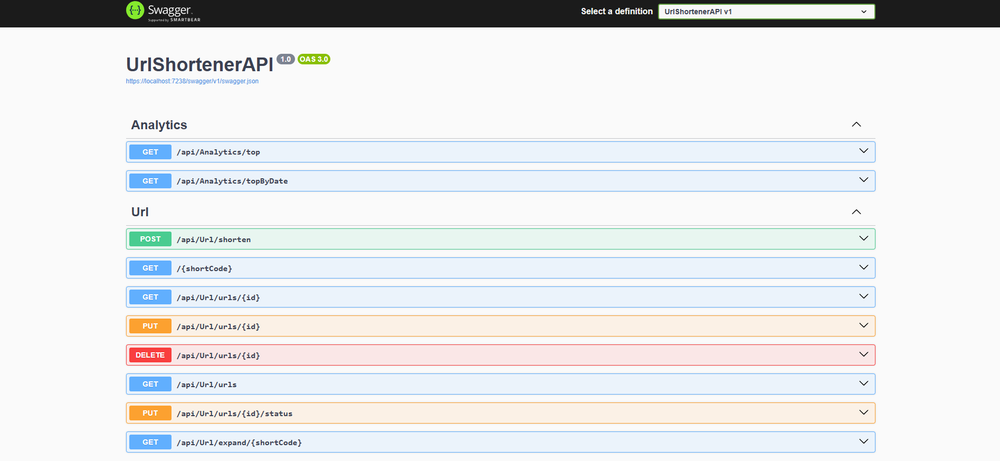
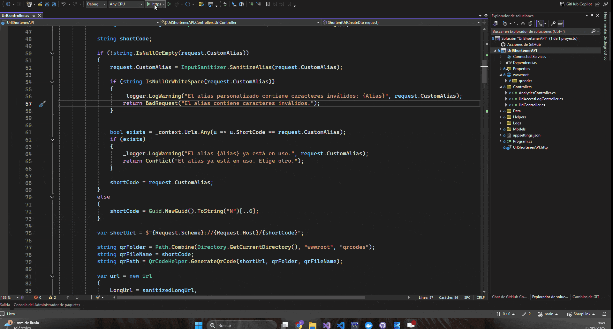
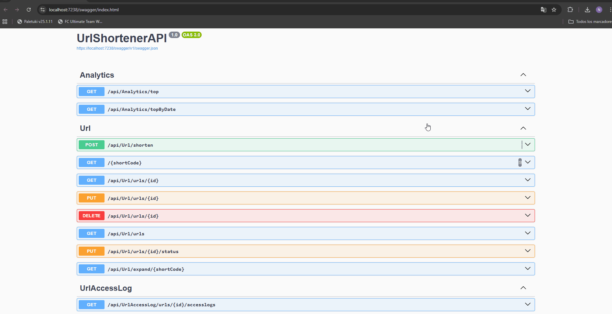

# 🔗 SharpLink

SharpLink es un **acortador de URLs** escrito en **C#** con **SQL Server** como base de datos.  
Permite generar enlaces cortos, redirigir a los destinos originales y registrar estadísticas de uso.



---

## 🚀 Características

- ✨ Acorta URLs largas en enlaces cortos y fáciles de compartir.
- 📊 Registra clics para análisis básicos.
- 🛡️ Validación de entradas y redirección segura.
- 🗄️ Base de datos en SQL Server (script incluido en `init.sql`).
- ⚡ API lista para integrarse en tus proyectos.

---

## 📂 Estructura del proyecto

```
SharpLink/
├── UrlShortenerAPI/      # Código fuente de la API
├── init.sql              # Script de inicialización de la base de datos
├── UrlShortenerAPI.sln   # Solución de Visual Studio
└── README.md             # Este archivo
```

---

## 🛠️ Requisitos

- [.NET 6+](https://dotnet.microsoft.com/en-us/download)
- [SQL Server](https://www.microsoft.com/en-us/sql-server/sql-server-downloads)
- Visual Studio / VS Code

---

## ⚙️ Instalación y configuración

1. Clona el repositorio:
   ```bash
   git clone https://github.com/nleceguic/SharpLink.git
   cd SharpLink
   ```

2. Restaura dependencias y compila:
   ```bash
   dotnet restore
   dotnet build
   ```

3. Configura la base de datos:
   - Ejecuta el script `init.sql` en tu instancia de SQL Server.
   - Ajusta la cadena de conexión en `appsettings.json`.

4. Lanza la API:
   ```bash
   dotnet run --project UrlShortenerAPI
   ```



---

## 📡 Uso de la API

La API se organiza en tres controladores:

| Controlador | Prefijo base | Descripción |
|---|---|---|
| `UrlController` | `/api/url` | Gestión completa de URLs |
| `AnalyticsController` | `/api/analytics` | Estadísticas de uso |
| `UrlAccessLogController` | `/api/urlaccesslog` | Logs de acceso por URL |

---

### UrlController

#### 1. Crear enlace corto
**POST** `/api/url/shorten`

Acorta una URL larga y genera automáticamente un código QR.

**Body:**
```json
{
  "longUrl": "https://ejemplo.com/pagina-muy-larga",
  "customAlias": "mi-alias",
  "expiresAt": "2026-12-31T23:59:59Z"
}
```

| Campo | Tipo | Requerido | Descripción |
|---|---|---|---|
| `longUrl` | string | Sí | URL de destino (debe comenzar con `http://` o `https://`) |
| `customAlias` | string | No | Alias personalizado para el enlace corto |
| `expiresAt` | datetime | No | Fecha y hora de expiración (UTC) |

**Respuesta `200 OK`:**
```json
{
  "originalUrl": "https://ejemplo.com/pagina-muy-larga",
  "shortUrl": "http://localhost:8080/mi-alias",
  "createdAt": "2026-06-09T12:00:00Z",
  "expiresAt": "2026-12-31T23:59:59Z",
  "isActive": true,
  "qrCodePath": "/qrcodes/mi-alias.png"
}
```

**Errores:**

| Código | Motivo |
|---|---|
| `400` | `longUrl` vacía o con formato inválido; alias con caracteres no permitidos |
| `409` | El alias personalizado ya está en uso |

---

#### 2. Redirigir a URL original
**GET** `/{shortCode}`

Incrementa el contador de clics, registra el acceso y redirige al destino.

**Parámetro de ruta:** `shortCode` — código corto del enlace.

**Respuesta `302 Found`:** Redirección HTTP hacia la URL original.

**Errores:**

| Código | Motivo |
|---|---|
| `400` | El enlace ha expirado o está desactivado |
| `404` | El código corto no existe |

---

#### 3. Obtener URL por ID
**GET** `/api/url/urls/{id}`

Devuelve los detalles de un enlace por su ID interno.

**Respuesta `200 OK`:**
```json
{
  "id": 1,
  "longUrl": "https://ejemplo.com/pagina-muy-larga",
  "shortCode": "mi-alias",
  "shortUrl": "http://localhost:8080/mi-alias",
  "clicks": 42,
  "createdAt": "2026-06-09T12:00:00Z",
  "lastAccessedAt": "2026-06-09T15:30:00Z",
  "expiresAt": "2026-12-31T23:59:59Z",
  "isActive": true
}
```

**Errores:** `404` si el ID no existe.

---

#### 4. Listar URLs con paginación
**GET** `/api/url/urls?pageNumber=1&pageSize=10`

Devuelve todas las URLs ordenadas por fecha de creación descendente.

**Query params:**

| Parámetro | Por defecto | Descripción |
|---|---|---|
| `pageNumber` | 1 | Número de página (mínimo 1) |
| `pageSize` | 10 | Registros por página (mínimo 1) |

**Respuesta `200 OK`:**
```json
{
  "pageNumber": 1,
  "pageSize": 10,
  "totalUrls": 50,
  "totalPages": 5,
  "urls": [
    {
      "id": 1,
      "longUrl": "https://ejemplo.com/pagina-muy-larga",
      "shortCode": "mi-alias",
      "shortUrl": "http://localhost:8080/mi-alias",
      "clicks": 42,
      "createdAt": "2026-06-09T12:00:00Z",
      "lastAccessedAt": "2026-06-09T15:30:00Z",
      "expiresAt": null,
      "isActive": true
    }
  ]
}
```

---

#### 5. Actualizar URL de destino
**PUT** `/api/url/urls/{id}`

Modifica la URL larga a la que apunta un enlace corto existente.

**Body:**
```json
{
  "longUrl": "https://ejemplo.com/nueva-url"
}
```

**Respuesta `200 OK`:** El objeto URL con los datos actualizados (mismos campos que `GET /urls/{id}`).

**Errores:**

| Código | Motivo |
|---|---|
| `400` | `longUrl` vacía |
| `404` | ID no encontrado |

---

#### 6. Cambiar estado activo/inactivo
**PUT** `/api/url/urls/{id}/status`

Activa o desactiva un enlace corto sin eliminarlo.

**Body:** `true` o `false` (booleano plano).

**Respuesta `200 OK`:**
```json
{
  "id": 1,
  "shortCode": "mi-alias",
  "isActive": false
}
```

**Errores:** `404` si el ID no existe.

---

#### 7. Eliminar URL
**DELETE** `/api/url/urls/{id}`

Elimina permanentemente un enlace corto y sus datos asociados.

**Respuesta `200 OK`:**
```json
{
  "message": "URL con ID 1 eliminada correctamente."
}
```

**Errores:** `404` si el ID no existe.

---

#### 8. Expandir código corto (sin redirigir)
**GET** `/api/url/expand/{shortCode}`

Devuelve la URL original y los metadatos del enlace **sin** realizar la redirección ni registrar el clic.

**Respuesta `200 OK`:**
```json
{
  "longUrl": "https://ejemplo.com/pagina-muy-larga",
  "shortCode": "mi-alias",
  "shortUrl": "http://localhost:8080/mi-alias",
  "createdAt": "2026-06-09T12:00:00Z",
  "expiresAt": null,
  "lastAccessedAt": "2026-06-09T15:30:00Z",
  "clicks": 42,
  "isActive": true,
  "qrCodePath": "/qrcodes/mi-alias.png",
  "status": "activo"
}
```

El campo `status` puede ser `"activo"`, `"inactivo"` o `"expirado"`.

**Errores:**

| Código | Motivo |
|---|---|
| `400` | El enlace está desactivado o ha expirado |
| `404` | El código corto no existe |

---

### AnalyticsController

#### 9. Top 10 URLs más visitadas
**GET** `/api/analytics/top`

Devuelve las 10 URLs con mayor número de clics acumulados.

**Respuesta `200 OK`:**
```json
[
  {
    "urlId": 1,
    "shortCode": "mi-alias",
    "shortUrl": "http://localhost:8080/mi-alias",
    "clicks": 42,
    "lastAccessedAt": "2026-06-09T15:30:00Z"
  }
]
```

---

#### 10. Top 10 URLs por rango de fechas
**GET** `/api/analytics/topByDate?fromDate=2026-01-01&toDate=2026-06-09`

Devuelve las 10 URLs con más clics dentro del rango especificado, calculado a partir de los logs de acceso.

**Query params:**

| Parámetro | Requerido | Descripción |
|---|---|---|
| `fromDate` | No | Fecha de inicio del rango (inclusive) |
| `toDate` | No | Fecha de fin del rango (inclusive) |

Si no se especifica ninguna fecha, devuelve el top global ordenado por logs.

**Respuesta `200 OK`:**
```json
[
  {
    "urlId": 1,
    "shortCode": "mi-alias",
    "shortUrl": "http://localhost:8080/mi-alias",
    "longUrl": "https://ejemplo.com/pagina-muy-larga",
    "clicks": 15,
    "lastAccessedAt": "2026-06-09T15:30:00Z"
  }
]
```

---

### UrlAccessLogController

#### 11. Logs de acceso de una URL
**GET** `/api/urlaccesslog/urls/{id}/accesslogs?pageNumber=1&pageSize=10`

Devuelve el historial de accesos de un enlace con paginación, ordenados del más reciente al más antiguo.

**Query params:**

| Parámetro | Por defecto | Descripción |
|---|---|---|
| `pageNumber` | 1 | Número de página (mínimo 1) |
| `pageSize` | 10 | Registros por página (mínimo 1) |

**Respuesta `200 OK`:**
```json
{
  "urlId": 1,
  "shortCode": "mi-alias",
  "shortUrl": "http://localhost:8080/mi-alias",
  "pageNumber": 1,
  "pageSize": 10,
  "totalLogs": 42,
  "totalPages": 5,
  "firstAccess": "2026-06-01T08:00:00Z",
  "lastAccess": "2026-06-09T15:30:00Z",
  "logs": [
    {
      "id": 100,
      "accessedAt": "2026-06-09T15:30:00Z",
      "ipAddress": "192.168.1.1",
      "userAgent": "Mozilla/5.0 ..."
    }
  ]
}
```

**Errores:** `404` si el ID de URL no existe.

---


---

## 📊 Ejemplo visual



---

## 🧪 Tests

El proyecto incluye pruebas unitarias para los principales endpoints y utilidades:

- **UrlController** — creación, redirección, expansión, actualización, cambio de estado y eliminación de URLs.
- **AnalyticsController** — top URLs globales y filtrado por rango de fechas.
- **UrlAccessLogController** — consulta de logs de acceso con paginación.
- **InputSanitizer** — sanitización de alias y URLs.
- **QrCodeHelper** — generación de códigos QR como archivos PNG.

Para ejecutar los tests:

```bash
dotnet test UrlShortenerAPI.Tests
```

---

## 🐳 Despliegue con Docker

Levanta la API y SQL Server con un solo comando:

```bash
docker-compose up --build
```

Esto arranca dos contenedores:
- **db** — SQL Server 2022 Express, inicializa la base de datos automáticamente con `init.sql` en el primer arranque.
- **api** — La API en .NET 8, disponible en `http://localhost:8080`.

Swagger estará disponible en `http://localhost:8080/swagger`.

Para detener y eliminar los contenedores:

```bash
docker-compose down
```

Para eliminar también los volúmenes de datos:

```bash
docker-compose down -v
```

> **Nota:** la contraseña de SA por defecto es `SharpLink!Pass2024`. Cámbiala en `docker-compose.yml` antes de desplegar en un entorno expuesto.

---

## 🤝 Contribuir

1. Haz un fork del proyecto.
2. Crea una rama con tu feature: `git checkout -b feature/nueva-feature`.
3. Haz commit: `git commit -m "Agrego nueva feature"`.
4. Haz push: `git push origin feature/nueva-feature`.
5. Abre un Pull Request.

---

## 📜 Licencia

Este proyecto está bajo licencia [MIT](LICENSE).

---

## ⭐ Agradecimientos

Si este proyecto te sirve, ¡dale una ⭐ en GitHub!
